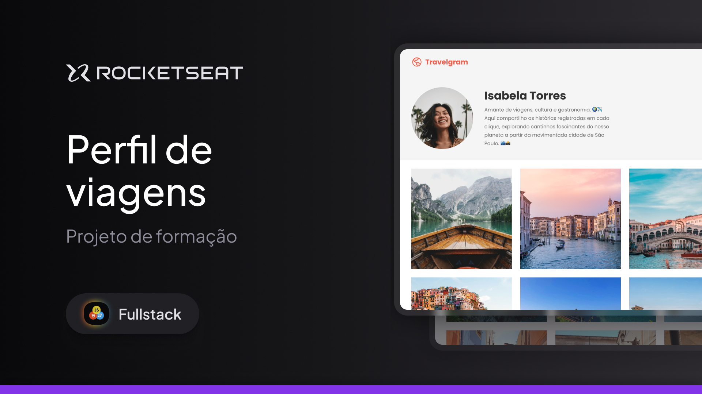

# 👥 Perfil-Viagens

Projeto desenvolvido com **HTML e CSS** puro, inspirado no visual e na estrutura do Instagram, com foco em postagens de fotos de viagens.

O projeto tem como objetivo praticar conceitos de layout moderno e responsivo, utilizando **Flexbox e CSS Grid Layout** para organizar o conteúdo de forma harmônica e adaptável a diferentes tamanhos de tela.

---

## 🖼️ Demonstração  

  

👉 [Acesse o projeto online](https://brrn91.github.io/perfil-viagens/)  

---

## 🛠️ Tecnologias Utilizadas  

- **HTML5** (estrutura semântica)  
- **CSS3** (estilização e responsividade)  
- **Grid Layout** (Para parte do perfil do usuário)
- **Flexbox** (Para o header)
- Fonte personalizada via **Google Fonts** ou sistema padrão
- **Figma**

---

## ⚙️ Funcionalidades  

- ✅ Layout responsivo para diferentes dispositivos (desktop / tablet / mobile)  
- ✅ Uso de semântica HTML para melhor acessibilidade  
- ✅ Código limpo, organizado, com boas práticas de CSS (classes reutilizáveis, variáveis CSS, etc)  

---

💡 **Nota:** Este projeto faz parte do meu aprendizado e portfólio. Feedbacks e sugestões são bem-vindos! 😊  

---

👨‍💻 Desenvolvido por [Brrn91](https://github.com/Brrn91)  

💡Créditos: [Rocketseat](https://app.rocketseat.com.br/)
